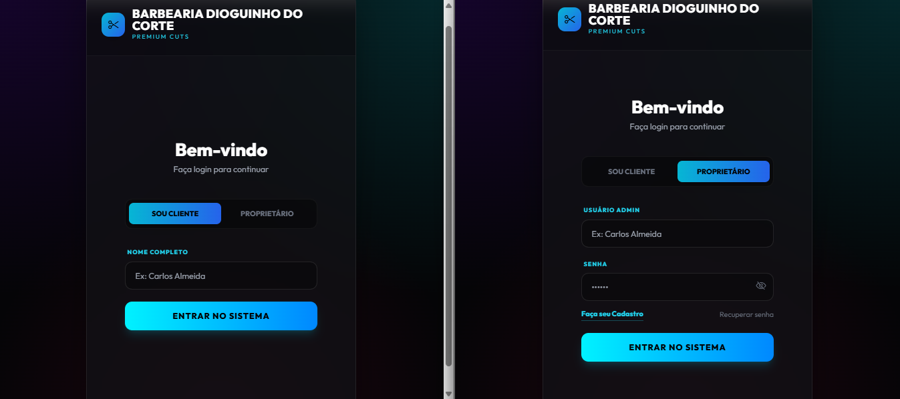

💈 Sistema de Barbearia | Agendamentos e Gestão
📸 Preview do Projeto

Sistema web desenvolvido para gerenciamento de uma barbearia, permitindo agendamentos online, controle administrativo e visualização financeira diária.
O projeto encontra-se em fase de testes, com funcionalidades já operacionais e foco em evolução contínua.

___

🎯 Objetivo do Projeto

Criar um sistema completo e funcional para barbearias, permitindo:

Agendamento de horários por clientes

Área administrativa para o proprietário

Controle de dias e horários de funcionamento

Gestão de serviços e valores

Relatórios diários com opção de impressão

Simulação de um sistema real sem back-end

___

👥 Perfis de Acesso
👤 Cliente

Login simplificado por nome

Visualização de horários disponíveis

Agendamento de serviços

Cancelamento de agendamentos

Histórico de próximos atendimentos

___

👨‍💼 Proprietário

Login com usuário e senha

Dashboard financeiro diário

Visualização de atendimentos realizados, futuros e cancelados

Configuração de:

Dias de funcionamento

Horários de abertura e fechamento

Intervalo de almoço

Bloqueios manuais de horários

Impressão de relatório diário (PDF via navegador)

___

🧠 Lógica e Armazenamento

Este projeto não utiliza back-end.
Todos os dados são manipulados via JavaScript e armazenados localmente utilizando:

localStorage

Estruturas de dados em JSON

Controle de estado em memória

Isso permite simular com fidelidade o comportamento de um sistema real.

___

🚀 Tecnologias Utilizadas

HTML5

CSS3

JavaScript (Vanilla JS)

JSON

Phosphor Icons

Git e GitHub

___

📱 Características do Projeto

Layout totalmente responsivo

Interface moderna com efeito glassmorphism

Separação clara entre área do cliente e do administrador

Regras de negócio aplicadas (horários, dias úteis, conflitos)

Sistema preparado para futura integração com back-end

Acesso ao Sistema https://diogo-netto.github.io/sistema-barbearia/
